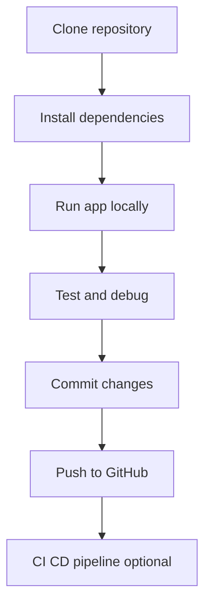
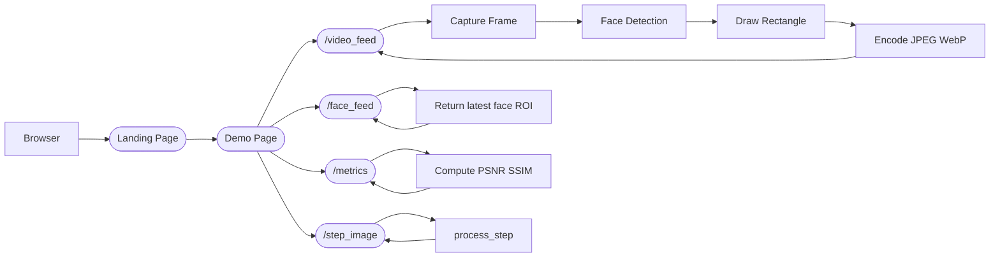

# Real-Time Face Compression Demo

A Flask-based web application that captures live webcam frames, detects faces, compresses frames with JPEG/WebP at variable quality, computes PSNR/SSIM metrics, and visualizes everything in real time.

---

## Features

- **Live Face Detection** using OpenCV Haar cascades  
- **On-the-fly Compression** to JPEG and WebP  
- **Quality Metrics**: PSNR & SSIM per frame  
- **Interactive Dashboard**:  
  - Adjust compression quality  
  - Preview each algorithm step  
  - View real-time charts of PSNR, SSIM, frame sizes, and PSNR difference  
- **Single-file Flask App** for easy deployment  

---

## Prerequisites

- Python 3.7+  
- Webcam or video capture device  
- pip packages:  
  ```bash
  pip install flask opencv-python numpy scikit-image


## Installation & Run

1. **Clone the repo**

   ```bash
   git clone https://github.com/yourusername/Realtime-Face-Detection.git
   cd face-compression-demo
   ```

2. **Install dependencies**

   ```bash
   pip install -r requirements.txt
   ```

3. **Run the server**

   ```bash
   python real_time_face_compression_flask.py
   ```

4. **Open in browser**
   Navigate to [http://localhost:5000](http://localhost:5000) for the landing page, then click **Proceed to Demo**.

---

## Project Structure

```
.
├── real_time_face_compression_flask.py   # Single-file Flask application
├── requirements.txt                     # pip dependencies
└── README.md                             # This documentation
```

---

## Architecture Overview

1. **Landing Page** (`/`)

   * Explains PSNR & SSIM
   * Describes each algorithm step and its significance
   * “Proceed to Demo” button

2. **Demo Page** (`/demo`)

   * **Live video** (`/video_feed`) with face rectangles
   * **Face ROI stream** (`/face_feed`)
   * **Step preview** (`/step_image?step=…`)
   * **Quality slider** (`/set_quality`)
   * **Metrics JSON** (`/metrics`) for Chart.js

3. **Background Thread**

   * Grabs frames continuously
   * Detects faces & stores latest ROI
   * Encodes to JPEG/WebP
   * Computes PSNR & SSIM, sizes, timestamps

---

## UML Diagrams

### 1. Development Flow



### 2. System Flow



---

## Further Reading

* **PSNR & SSIM** fundamentals:
  Wang Z., Bovik A.C., Sheikh H.R., Simoncelli E.P. “Image Quality Assessment: From Error Visibility to Structural Similarity.” *IEEE Transactions on Image Processing*, 2004.
* **OpenCV Haar Cascades** tutorial:
  [https://docs.opencv.org/4.x/db/d28/tutorial\_cascade\_classifier.html](https://docs.opencv.org/4.x/db/d28/tutorial_cascade_classifier.html)

---

*Feel free to open issues or submit pull requests!*
