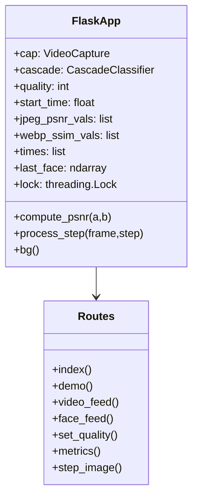
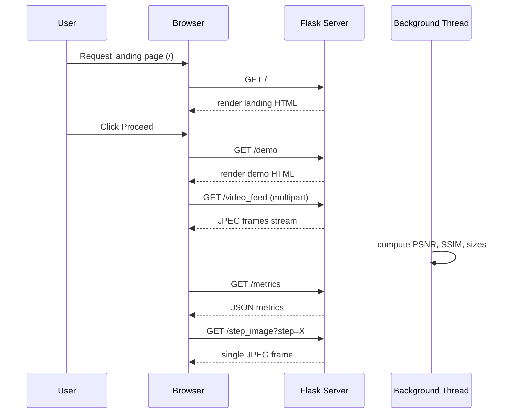
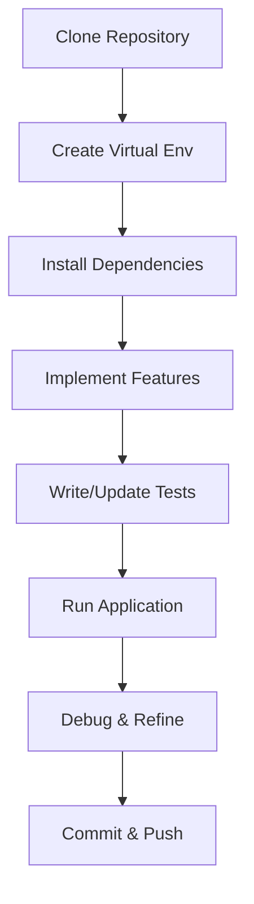

# Real-Time Face Compression

This repository contains a Flask-based real-time face detection and image compression demo, showcasing JPEG and WebP compression quality metrics (PSNR & SSIM) in live video feeds.

---

## Features

* **Real-time Face Detection:** Uses OpenCV Haar cascades to detect and display faces.
* **Compression Formats:** Compare JPEG vs. WebP at user-controlled quality levels.
* **Quality Metrics:** Compute PSNR (Peak Signal-to-Noise Ratio) and SSIM (Structural Similarity Index) for objective and perceptual quality measurements.
* **Live Charts:** Dynamic rendering of PSNR, SSIM, file size (KB), and PSNR difference over time.
* **Interactive UI:** Slider for quality control, step-by-step algorithm preview, and responsive design.

---

## Installation

```bash
# Clone the repo
git clone https://github.com/yourusername/face-compression-demo.git
cd face-compression-demo

# Create virtual environment
python3 -m venv venv
source venv/bin/activate

# Install dependencies
pip install -r requirements.txt
```

**Requirements:**

* Python 3.7+
* Flask
* OpenCV-Python
* scikit-image

---

## Usage

```bash
python real_time_face_compression_flask.py
```

Open your browser at `http://localhost:5000/` to view the landing page. Click **Proceed to Demo** to start the real-time demo.

---

## Architecture Overview

The application consists of a single Flask file (`real_time_face_compression_flask.py`) with the following components:

1. **Landing Page:** Introduces PSNR & SSIM and outlines pipeline steps.
2. **Demo Page:** Streams live video, detected faces, algorithm steps, and charts.
3. **Background Thread:** Continuously captures frames, computes compression/decompression, metrics, and buffers results.
4. **Flask Routes:** Serve landing page, demo page, video/face feeds, metrics JSON, and step images.





---

## File Structure

```
face-compression-demo/
├── real_time_face_compression_flask.py  # Main application
├── requirements.txt                    # Dependencies
└── README.md                           # This documentation
```

---

## UML Diagrams

### Development Flow



### System Flow

````mermaid
flowchart LR
    subgraph Client [Browser]
        U[User] -->|Click Proceed| DemoPage[Demo Page]
        DemoPage -->|Stream| VideoFeed
        DemoPage -->|Stream| FaceFeed
        DemoPage -->|Poll every 1s| Metrics[Metrics Endpoint]
        DemoPage -->|Request| StepImage[Step Image Endpoint]
    end

    subgraph Server [Flask App]
        VideoFeed -->|Generate JPEG| Camera[Webcam]
        FaceFeed -->|Crop Face ROI| Camera
        Metrics -->|Return JSON| Logger[bg Thread]
        StepImage -->|Process Frame| Processor[process_step()]
    end

    Camera --> Logger
    Processor -->|Returns| StepImage
    Logger --> Metrics
```mermaid
flowchart LR
    subgraph Client [Browser]
        U[User] -->|Click "Proceed"| DemoPage[Demo Page]
        DemoPage -->|Stream| VideoFeed
        DemoPage -->|Stream| FaceFeed
        DemoPage -->|Poll every 1s| Metrics[Metrics Endpoint]
        DemoPage -->|Request| StepImage[Step Image Endpoint]
    end

    subgraph Server [Flask App]
        VideoFeed -->|Generate JPEG| Camera[Webcam]
        FaceFeed -->|Crop Face ROI| Camera
        Metrics -->|Return JSON| Logger[bg Thread]
        StepImage -->|Process Frame| Processor[process_step()]
    end

    Camera --> Logger
    Processor -->|Returns| StepImage
    Logger --> Metrics
````

---

## License

MIT License. See [LICENSE](LICENSE) for details.
